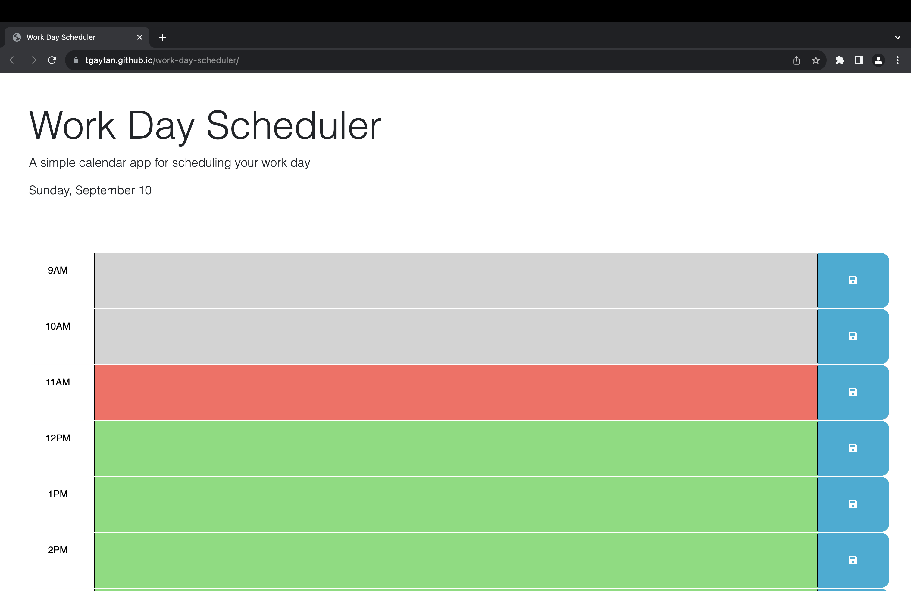

# Work Day Scheduler

## Description

This is a work day scheduler that you can use to schedule events by the hour for the current day.  This app was created to practice jQuery and use it to modify html and css based off the hour of current day.  Local storage is also utilized to save the user data and can render this data on the page if it is refreshed.

## Installation

N/A

## Usage

Open a browser and navigate to "https://tgaytan.github.io/work-day-scheduler/".  Below is a screenshot of how the web page appears when it is first loaded.

The current date will be displayed at the top of the page and there are rows representing the hours of the day.  The color of the row indicates if the hour is past, present, or future.

past = gray
present = red
future = green

To save events, type in the text field and then hit the save button.  The data is saved to the local storage so the note will still be displayed if the page is refreshed.

## Credits

The starter code was provided by The University of Texas at Austin online coding boot camp.  Day.js was used to get the current time.  The starter code can be found in the "starterCode" directory.

## License

N/A

## Tests

To test that the block colors change depending on the hour, you can modify line 5 in the ./assets/js/script.js file.  Comment out "dayjs().hour();" and then set the hour variable to the hour you want to simulate.  Use 24 hour time.